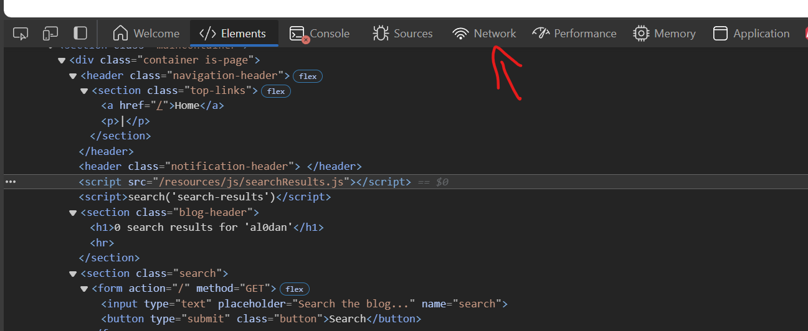

# Reflected-DOM-XSS
hello this writeup is for reflected DOM XSS!!
by: al0dan

so let's get started, as we can see looks like you every day website

lets hit it with a alpha-numeric search string i will use "al0dan"

our search string is shown back, fully, on the web page now we need to find where in the dom our search string appears and how it's processed this will help us figure out how to solve the lab

right-click on the search string that came back and pick "inspect" from the menu. this will open the dom browser with the search string highlighted

`

<section class="blog-header">
    <h1>0 search results for 'al0dan'</h1>
    

</section>
`

see our reflected search string in the `<h1>` tag? also notice the `, tells us where to start looking

click on searchResults.js a new window will open with several tabs you'll start on the 'headers' tab but we need to check the 'response'

click on 'response'

`
function search(path) {
var xhr = new XMLHttpRequest();
xhr.onreadystatechange = function() {
};
if (this.readyState== 4 && this.status == 200) { eval('var searchResultsObj = this.responseText); displaySearchResults (searchResultsObj);
}
xhr.open("GET", path+window.location.search);
xhr.send();
function
displaySearchResults (searchResultsObj) {
var blogHeader = document.getElementsByClassName("blog-header")[0]; var blogList = document.getElementsByClassName("blog-list")[0]; var searchTerm = searchResultsObj.searchTerm
var searchResults = searchResultsObj.results
`
see the processes of our search string

the javascript is simple and easy

the object xhr was created, and an HTTP `GET` request was sent to:

`("GET", path + window.location.search)`

or

`('search-results' + '?search=al0dan')`

clicking on search-results?search=al00dan and checking the 'response' tab you'll see the response in JSON format our results are also enclosed in double quotes

we need to experiment with our search string to see how different characters affect our json response and now is the time to use burp sutie

here we can see both the request and the response from search-results?search=al0dan in burp sutie

from this point right-click inside the request box and select ‘send to repeater’ then go to the repeater tab

on the left side of burp repeater, you can modify your search string to attempt to 'break out' of the response since our searchTerm results are in double quotes we will start by adding a single double quote to the end of our search string along with our alert() function
`al0dan"-alert(1)`
see what happends

the backslash that appears is an escape character used to indicate to ignore the next character not allowing it from terminating the searchTerm

as you can see the double quote is still returned on the page

what if we add our own escape character before the double quote like this

al0dan\"-alert(1)

see how our search string is processed in burp sutie

now our double quote has terminated our search string and our -alert(1) has been successfully broken out!

it’s still not a valid payload because we have the closing double quote and curly brace meant to close the javascript object

to create a usable payload we need to manually close the javascript object by adding a closing curly brace } to our payload then we can comment out everything following it with //

`al0dan\"-alert(1)}//`

enter this payload into burp repeater and hit send and see what happends

woohoo as you can see at worked thanks for reading

